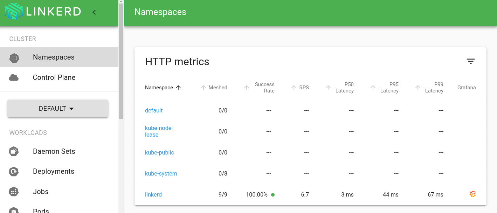

# Module 1 - Getting Started 

This module installs the [Linkerd Service Mesh](https://linkerd.io/) to an [AWS EKS](https://aws.amazon.com/eks/) Kubernetes cluster

## Prerequisites:

To be able to work with this pattern you should have completed these [prerequisite steps](../../prerequisites/README.md).

## Preflight

Validate the target EKS cluster:
   ```sh
   linkerd check --pre
   ```
<details>
<summary>With expected output:</summary>

   ```sh
   kubernetes-api
   --------------
   √ can initialize the client
   √ can query the Kubernetes API
   
   kubernetes-version
   ------------------
   √ is running the minimum Kubernetes API version
   
   pre-kubernetes-setup
   --------------------
   √ control plane namespace does not already exist
   √ can create non-namespaced resources
   √ can create ServiceAccounts
   √ can create Services
   √ can create Deployments
   √ can create CronJobs
   √ can create ConfigMaps
   √ can create Secrets
   √ can read Secrets
   √ can read extension-apiserver-authentication configmap
   √ no clock skew detected
   
   linkerd-version
   ---------------
   √ can determine the latest version
   √ cli is up-to-date
   
   Status check results are √
   ```

</details>

If there are any checks that do not pass, make sure to follow the provided links and fix those issues before proceeding.

> Note: The `linkerd` CLI provides a straightforward path to the Service Mesh, however, it is recommended only for non-Production workloads

> Note: The `linkerd` CLI installs the latest edge release of the Service Mesh; the [Releases & Versions](https://linkerd.io/releases/) page tracks milestones

## Deploy 
Installation of Linkerd is in two steps - Custom Resource Definitions followed by the Service Mesh:

```sh
linkerd install --crds | kubectl apply -f -
linkerd install | kubectl apply -f -
```

Each command should output confirmation of Resources created or updated.

<details>
<summary>With expected output:</summary>
```sh
Rendering Linkerd CRDs...
Next, run `linkerd install | kubectl apply -f -` to install the control plane.

customresourcedefinition.apiextensions.k8s.io/authorizationpolicies.policy.linkerd.io created
customresourcedefinition.apiextensions.k8s.io/httproutes.policy.linkerd.io created
customresourcedefinition.apiextensions.k8s.io/meshtlsauthentications.policy.linkerd.io created
customresourcedefinition.apiextensions.k8s.io/networkauthentications.policy.linkerd.io created
customresourcedefinition.apiextensions.k8s.io/serverauthorizations.policy.linkerd.io created
customresourcedefinition.apiextensions.k8s.io/servers.policy.linkerd.io created
customresourcedefinition.apiextensions.k8s.io/serviceprofiles.linkerd.io created
customresourcedefinition.apiextensions.k8s.io/httproutes.gateway.networking.k8s.io created
customresourcedefinition.apiextensions.k8s.io/grpcroutes.gateway.networking.k8s.io created
customresourcedefinition.apiextensions.k8s.io/externalworkloads.workload.linkerd.io created

...

namespace/linkerd created
clusterrole.rbac.authorization.k8s.io/linkerd-linkerd-identity created
clusterrolebinding.rbac.authorization.k8s.io/linkerd-linkerd-identity created
serviceaccount/linkerd-identity created
clusterrole.rbac.authorization.k8s.io/linkerd-linkerd-destination created
clusterrolebinding.rbac.authorization.k8s.io/linkerd-linkerd-destination created
serviceaccount/linkerd-destination created
secret/linkerd-sp-validator-k8s-tls created
validatingwebhookconfiguration.admissionregistration.k8s.io/linkerd-sp-validator-webhook-config created
secret/linkerd-policy-validator-k8s-tls created
validatingwebhookconfiguration.admissionregistration.k8s.io/linkerd-policy-validator-webhook-config created
clusterrole.rbac.authorization.k8s.io/linkerd-policy created
clusterrolebinding.rbac.authorization.k8s.io/linkerd-destination-policy created
role.rbac.authorization.k8s.io/remote-discovery created
rolebinding.rbac.authorization.k8s.io/linkerd-destination-remote-discovery created
role.rbac.authorization.k8s.io/linkerd-heartbeat created
rolebinding.rbac.authorization.k8s.io/linkerd-heartbeat created
clusterrole.rbac.authorization.k8s.io/linkerd-heartbeat created
clusterrolebinding.rbac.authorization.k8s.io/linkerd-heartbeat created
serviceaccount/linkerd-heartbeat created
clusterrole.rbac.authorization.k8s.io/linkerd-linkerd-proxy-injector created
clusterrolebinding.rbac.authorization.k8s.io/linkerd-linkerd-proxy-injector created
serviceaccount/linkerd-proxy-injector created
secret/linkerd-proxy-injector-k8s-tls created
mutatingwebhookconfiguration.admissionregistration.k8s.io/linkerd-proxy-injector-webhook-config created
configmap/linkerd-config created
role.rbac.authorization.k8s.io/ext-namespace-metadata-linkerd-config created
secret/linkerd-identity-issuer created
configmap/linkerd-identity-trust-roots created
service/linkerd-identity created
service/linkerd-identity-headless created
deployment.apps/linkerd-identity created
service/linkerd-dst created
service/linkerd-dst-headless created
service/linkerd-sp-validator created
service/linkerd-policy created
service/linkerd-policy-validator created
deployment.apps/linkerd-destination created
cronjob.batch/linkerd-heartbeat created
deployment.apps/linkerd-proxy-injector created
service/linkerd-proxy-injector created
secret/linkerd-config-overrides created
```

</details>

## Validate

Validate the Linkerd install by re-using the `check` command:

```sh
linkerd check
```

<details>
<summary>With expected output:</summary>

```sh
Status check results are √
```

</details>

Take note of any errors or warnings and address as necessary

> Note: You can run view the Linkerd Services by executing `kubectl --namespace linkerd get service`

## Visualize
Linkerd Service Mesh is now installed and waiting to be activated for workloads (in the next [module](../02-example-workload/README.md)).


In the meantime, Linkerd provides an extension called *viz* for inspecting the Service Mesh:
1. Install:
   ```sh
   linkerd viz install | kubectl apply -f -
   ```

2. Validate (optional):
   ```sh
   linkerd check
   ```

<details>
<summary>With expected output:</summary>

   ```sh
   linkerd-viz
   -----------
   √ linkerd-viz Namespace exists
   √ can initialize the client
   √ linkerd-viz ClusterRoles exist
   √ linkerd-viz ClusterRoleBindings exist
   √ tap API server has valid cert
   √ tap API server cert is valid for at least 60 days
   √ tap API service is running
   √ linkerd-viz pods are injected
   √ viz extension pods are running
   √ viz extension proxies are healthy
   √ viz extension proxies are up-to-date
   √ viz extension proxies and cli versions match
   √ prometheus is installed and configured correctly
   √ viz extension self-check
   ```

</details>

3. View (will open a tab or browser window):
   ```sh
   linkerd viz dashboard &
   ```

   Since none of the workloads have activated Linkerd (yet), expect the *Meshed* column in *viz* to reflect 0:



## Destroy 

To remove all components:
1. Uninstall *viz*
   ```sh
   # To remove Linkerd Viz
   linkerd viz uninstall | kubectl delete -f -
   ```

2. Uninstall Linkerd Control Plane (also removes the CRDs):
   ```sh
   linkerd uninstall | kubectl delete -f -
   ```
