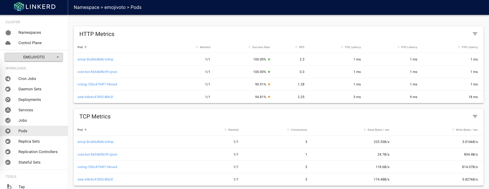

# Module 2 - Example Workload

This module shows how to activate Linkerd on an example application; Linkerd provides an application called `emojivoto` for experimentation

## Prerequisites:
1. Perform preflight check (optional):
   ```sh
   linkerd check
   ```

## Install 
1. Install the `emojivoto` application:
   ```sh
   curl --proto '=https' --tlsv1.2 -sSfL https://run.linkerd.io/emojivoto.yml \
   | kubectl apply -f -
   ```

2. Visit the application (optional):

   Forward connections to the `emojivoto` Service:
   ```sh
   kubectl -n emojivoto port-forward svc/web-svc 8080:80
   ```

   Visit http://localhost:8080 in a web browser

> Note: Because Linkerd is not yet activated, some functionality may return errors or incorrect behavior; this is expected for now.

## Activate Linkerd

1. Linkerd (can) use the built-in Kubernetes rolling deployment capabilities to inject the sidecar
   ```sh
   kubectl get -n emojivoto deploy -o yaml \
   | linkerd inject - \
   | kubectl apply -f -
   ```

   Expect output similar to:
   ```sh
   deployment "emoji" injected
   deployment "vote-bot" injected
   deployment "voting" injected
   deployment "web" injected

   deployment.apps/emoji configured
   deployment.apps/vote-bot configured
   deployment.apps/voting configured
   deployment.apps/web configured
   ```

> Note: This is a text-transform operation, meaning that the `linkerd inject` command is adding an annotation (`linkerd.io/inject: enabled`) to the manifest returned by `kubectl get` and then passing the modified manifest back to `kubectl apply`
>
> Executing `kubectl get -n emojivoto deploy -o yaml | linkerd inject -` will display the manifest but not make any changes


2. Check the activation (optional):
   ```sh
   linkerd -n emojivoto check --proxy
   ```

   This will produce lots of output, but should include a summary:
   ```sh
   Status check results are √
   ```

2. Check the *viz* dashboard (optional):

